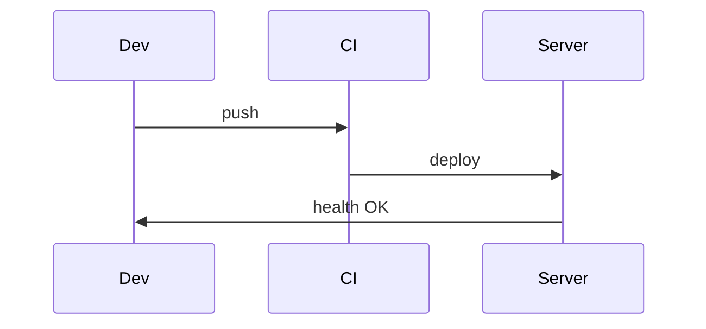

# Rollback: HTML → Markdown enriquecido

Guía para **revertir** la implementación de `interactive-docs-playbook` (HTML) y migrar a Markdown enriquecido nativo de GitHub.

## Cuándo usar este rollback

- HTML requiere servidor local para visualizar
- No se puede ver documentación directamente en GitHub
- Toolchain de HTML es demasiado complejo para el equipo
- Se prefiere portabilidad (GitLab, Obsidian, VS Code)
- Se quiere simplificar mantenimiento de docs

## Fase 1: Backup y preparación

```bash
# 1. Crear branch de rollback
git checkout -b docs/rollback-html-to-md

# 2. Backup del estado actual (por las dudas)
mkdir -p .backup/html-docs-$(date +%Y%m%d)
cp -r docs/*.html .backup/html-docs-$(date +%Y%m%d)/
cp -r docs/assets/doc-html .backup/html-docs-$(date +%Y%m%d)/
cp tools/build-doc-html.mjs .backup/html-docs-$(date +%Y%m%d)/ 2>/dev/null || true

# 3. Listar guías actuales
ls -lh docs/*.html > .backup/html-docs-list.txt
```

## Fase 2: Conversión HTML → Markdown

### Opción A: Conversión automatizada (recomendada)

Crear script de conversión:

```bash
cat > tools/html-to-md.mjs << 'EOF'
import fs from 'fs';
import { glob } from 'glob';

// Encontrar todos los HTML (excepto index)
const htmlFiles = glob.sync('docs/**/*.html', { ignore: 'docs/index.html' });

for (const htmlPath of htmlFiles) {
  const html = fs.readFileSync(htmlPath, 'utf8');
  const mdPath = htmlPath.replace('.html', '.md');
  
  // Conversión básica (ajustar según tu estructura)
  let md = html;
  
  // Extraer contenido de <main>
  const mainMatch = md.match(/<main[^>]*>([\s\S]*)<\/main>/);
  if (mainMatch) md = mainMatch[1];
  
  // Convertir banners a alerts
  md = md.replace(/<div class="banner danger"[^>]*>([\s\S]*?)<\/div>/g, (_, content) => {
    const text = content.replace(/<[^>]+>/g, '').trim();
    return `> [!WARNING]\n> ${text}\n`;
  });
  
  md = md.replace(/<div class="banner warn"[^>]*>([\s\S]*?)<\/div>/g, (_, content) => {
    const text = content.replace(/<[^>]+>/g, '').trim();
    return `> [!CAUTION]\n> ${text}\n`;
  });
  
  md = md.replace(/<div class="banner info"[^>]*>([\s\S]*?)<\/div>/g, (_, content) => {
    const text = content.replace(/<[^>]+>/g, '').trim();
    return `> [!NOTE]\n> ${text}\n`;
  });
  
  // Limpiar tags HTML comunes
  md = md.replace(/<h2[^>]*>(.*?)<\/h2>/g, '## $1');
  md = md.replace(/<h3[^>]*>(.*?)<\/h3>/g, '### $1');
  md = md.replace(/<p[^>]*>(.*?)<\/p>/g, '$1\n\n');
  md = md.replace(/<pre[^>]*>(.*?)<\/pre>/gs, '```\n$1\n```\n');
  md = md.replace(/<code>(.*?)<\/code>/g, '`$1`');
  md = md.replace(/<strong>(.*?)<\/strong>/g, '**$1**');
  md = md.replace(/<em>(.*?)<\/em>/g, '*$1*');
  md = md.replace(/<a href="([^"]+)">(.*?)<\/a>/g, '[$2]($1)');
  md = md.replace(/<ul[^>]*>([\s\S]*?)<\/ul>/g, (_, items) => {
    return items.replace(/<li[^>]*>(.*?)<\/li>/g, '- $1\n');
  });
  
  // Limpiar líneas vacías excesivas
  md = md.replace(/\n{3,}/g, '\n\n');
  
  // Escribir
  fs.writeFileSync(mdPath, md.trim() + '\n');
  console.log(`✓ ${htmlPath} → ${mdPath}`);
}

console.log(`\n✅ Convertidos ${htmlFiles.length} archivos`);
EOF

# Ejecutar conversión
node tools/html-to-md.mjs
```

### Opción B: Conversión manual (más control)

Para cada guía HTML:

1. Abrir el `.html` en editor
2. Copiar contenido de `<main>`
3. Crear `.md` hermano
4. Convertir manualmente:
   - `<div class="banner danger">` → `> [!WARNING]`
   - `<div class="banner warn">` → `> [!CAUTION]`
   - `<div class="banner info">` → `> [!NOTE]` o `> [!TIP]`
   - `.tabs` → múltiples `<details>`
   - `.status-matrix` → table con emojis
   - `.phase-grid` → lista con emojis
   - `pre.mermaid` → fence ```mermaid```

## Fase 3: Enriquecimiento Markdown

Aplicar [rich-markdown-playbook](./SKILL.md) a los `.md` generados:

```bash
# Seguir checklist del playbook:
# [ ] Agregar alerts estratégicos
# [ ] Convertir flujos a Mermaid
# [ ] Wrappear contenido avanzado en <details>
# [ ] Agregar task lists donde aplique
# [ ] Crear docs/README.md como índice
```

**Ejemplo de enriquecimiento:**

```markdown
<!-- ANTES (HTML convertido básico) -->
## Deploy

Build, subir, verificar.

<!-- DESPUÉS (enriquecido) -->
## Deploy

> [!WARNING]
> Backup de DB antes de deployar.

### Pasos

- [ ] Build: `pnpm build`
- [ ] Upload: `rsync -avz dist/ server:/var/www/`
- [ ] Verificar: `curl https://app.com/health`

<details>
<summary>🔧 Troubleshooting</summary>

Si falla el health check:
1. Revisar logs
2. Verificar env vars
3. Reiniciar servicio

</details>


```

## Fase 4: Crear índice Markdown

```bash
cat > docs/README.md << 'EOF'
# Documentación

Guías operativas enriquecidas con Markdown nativo de GitHub.

## Por categoría

### Producto
- [Requerimientos](./requerimientos.md) — Spec de producto, RF/RNF
- [Diseño](./styling.md) — Manual de diseño

### Implementación
- [Plan técnico](./implementation-plan.md) — Stack, ADRs, fases MVP
- [Estado del proyecto](./zenith-acuerdos-plan.md) — Plan maestro
- [Auditoría](./auditoria-implementacion.md) — Brechas docs vs código

### QA
- [Guía de testing](./testing-guide.md) — Capas, VAL-*, mapa RF/CU
- [User stories QA](./qa-user-stories.md) — 20 HU exploratorias

### Comercial
- [Manual de ventas](./manual-ventas.md) — Guion demo, objeciones
- [Kit marketing](./kit-promocion-marketing.md) — Posicionamiento GTM
- [Dossier comercial](./dossier-comercial.md) — Propuesta B2B / SOW
- [Descubrimiento](./descubrimiento-compradores.md) — Brief prospección

---

**Formato:** Markdown enriquecido con [GitHub Alerts](https://docs.github.com/en/get-started/writing-on-github/getting-started-with-writing-and-formatting-on-github/basic-writing-and-formatting-syntax#alerts) y [Mermaid](https://mermaid.js.org/).
EOF
```

## Fase 5: Limpieza del toolchain HTML

```bash
# 1. Remover archivos HTML
rm docs/*.html
rm docs/index.html

# 2. Remover assets
rm -rf docs/assets/doc-html

# 3. Remover toolchain
rm tools/build-doc-html.mjs 2>/dev/null || true

# 4. Opcional: remover skill HTML (si ya no se usa)
# rm -rf .agents/skills/interactive-docs-playbook

echo "✅ Toolchain HTML removido"
```

## Fase 6: Actualizar AGENTS.md

Reemplazar la sección de docs con:

```markdown
## Documentación: Markdown enriquecido nativo

Las guías operativas están en **Markdown** con features nativas de GitHub:
- **Alerts:** `> [!NOTE]`, `> [!WARNING]`, `> [!TIP]`, `> [!IMPORTANT]`, `> [!CAUTION]`
- **Mermaid:** diagramas de flujo en fences ```mermaid```
- **Collapsibles:** `<details><summary>` para contenido expandible
- **Tables:** estados, comparaciones (usar emojis ✅⚠️❌)
- **Task lists:** `- [ ]` para checklists

Índice canónico: [`docs/README.md`](docs/README.md)

### Anti-patrones (docs)

- Procedimiento de >200 líneas sin alerts ni estructura
- Guías sin enlaces cruzados a documentos relacionados
- Diagramas como imágenes estáticas (usar Mermaid)
- Warnings/tips en texto plano en lugar de alerts nativos
- Contenido avanzado sin `<details>` (dificulta escaneo)
- Links rotos tras renombrar archivos
```

## Fase 7: Actualizar README del proyecto

En `README.md` principal, actualizar sección de docs:

```markdown
## Documentación

Índice canónico: **[`docs/README.md`](docs/README.md)** (guías enriquecidas con Markdown nativo de GitHub).

Las guías usan:
- **GitHub Alerts** para callouts (NOTE, TIP, WARNING, etc.)
- **Mermaid** para diagramas de flujo
- **Collapsibles** (`<details>`) para contenido avanzado

Todas las guías se ven directamente en GitHub, sin necesidad de servidor local.
```

## Fase 8: Commits y PR

```bash
# 1. Stage de cambios
git add docs/ tools/ README.md AGENTS.md

# 2. Commit estructurado
git commit -m "docs: migrate from HTML to GitHub-flavored Markdown

- Convert 11 HTML guides to .md with native alerts
- Add Mermaid diagrams for flows
- Use <details> for collapsibles  
- Create docs/README.md as navigation hub
- Remove HTML toolchain (build script + assets)

BREAKING CHANGE: docs/*.html no longer exist
Migration: all guides now in Markdown at docs/*.md
Index: docs/README.md (was docs/index.html)

Closes #XXX"

# 3. Push y crear PR
git push -u origin docs/rollback-html-to-md

# 4. Crear PR en GitHub con template:
# Título: docs: migrate from HTML to Markdown
# Descripción: explicar ventajas, listar guías migradas, mencionar breaking change
```

## Fase 9: Validación post-merge

```bash
# Verificar que guías se ven en GitHub
# 1. Abrir docs/README.md en GitHub
# 2. Navegar a 2-3 guías prioritarias
# 3. Verificar que alerts, Mermaid, y <details> renderizan OK
# 4. Probar enlaces cruzados

# Si algo falla, rollback es simple:
git revert <commit-hash>
# Y restaurar desde .backup/html-docs-YYYYMMDD/
```

## Checklist de rollback

```text
[ ] Backup de HTML actual creado
[ ] Script de conversión probado en 1-2 guías
[ ] Conversión completa ejecutada
[ ] Markdown enriquecido (alerts, Mermaid, collapsibles)
[ ] docs/README.md creado como índice
[ ] Enlaces cruzados agregados
[ ] HTML + assets + toolchain removidos
[ ] AGENTS.md actualizado
[ ] README principal actualizado
[ ] Commits limpios con BREAKING CHANGE
[ ] PR creado y revisado
[ ] Validación post-merge en GitHub
```

## Troubleshooting

### Problema: Conversión pierde formato

**Solución:** Revisar script `html-to-md.mjs` y ajustar regex para tu estructura HTML específica. Considerar conversión manual de 1-2 guías complejas.

### Problema: Mermaid no renderiza

**Solución:** Verificar sintaxis en [Mermaid Live Editor](https://mermaid.live/). GitHub soporta Mermaid desde 2022, debería funcionar.

### Problema: Equipo extraña interactividad de HTML

**Solución:** 
- Mostrar que `<details>` es interactivo
- Task lists (`- [ ]`) son clickeables en Issues/PRs
- Para checklists complejos, considerar GitHub Projects

### Problema: Necesito rollback del rollback

**Solución:**
```bash
# Restaurar HTML desde backup
cp -r .backup/html-docs-YYYYMMDD/* docs/
git add docs/
git commit -m "docs: restore HTML guides from backup"
```

---

**Ver también:**
- [rich-markdown-playbook SKILL.md](./SKILL.md) — guía completa de enriquecimiento
- [GitHub Markdown syntax](https://docs.github.com/en/get-started/writing-on-github/getting-started-with-writing-and-formatting-on-github/basic-writing-and-formatting-syntax)
- [Mermaid documentation](https://mermaid.js.org/)
