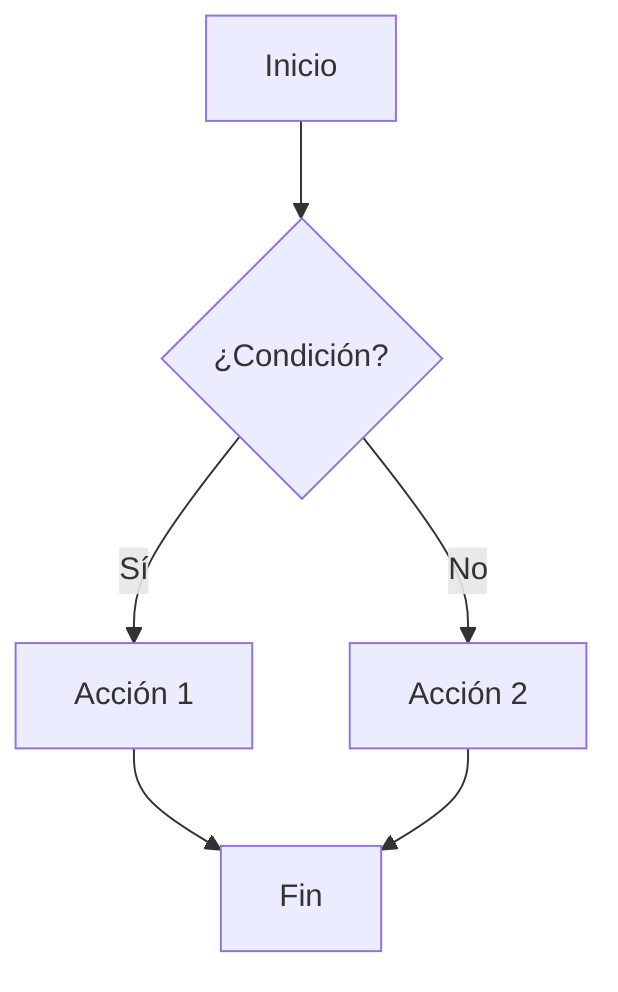
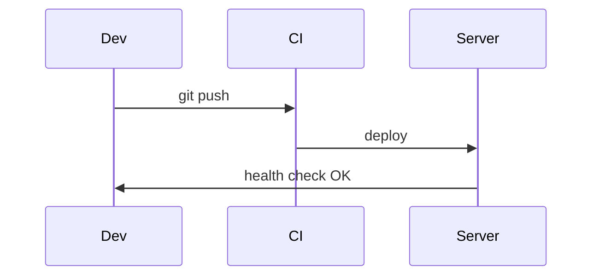
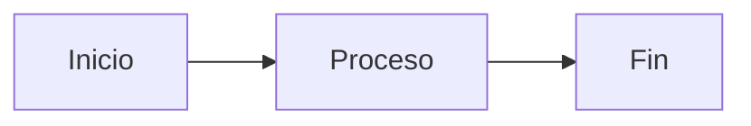

# Rich Markdown Playbook — MD plano → MD enriquecido

Hoja de ruta **portable** para agentes. Objetivo: transformar documentación Markdown plana en **guías enriquecidas con features nativas de GitHub**: alerts, diagramas Mermaid, collapsibles, tables, y navegación cruzada.

**Prompt de arranque (usuario → agente):**

> Leé `.agents/skills/rich-markdown-playbook/SKILL.md` y seguí el playbook
> completo en este repo: inventario → conversión → enriquecimiento → gobernanza
> en AGENTS.md. Usá Markdown nativo de GitHub, sin toolchain externo.

---

## 1. Problema que resuelve

| Antes | Después |
| --- | --- |
| Docs `.md` planas de 300–600 líneas sin estructura | Guías `.md` con alerts, diagramas, collapsibles |
| Solo texto corrido, difícil de escanear | Jerarquía visual: callouts, tables, emojis |
| HTML complejo que no se ve en GitHub | Markdown 100% nativo, se renderiza perfecto en GitHub |
| Necesita servidor local o Pages para ver | Se ve directo en GitHub, portable a GitLab/Obsidian |

**Ventajas clave:**
- ✅ **Nativo de GitHub:** se renderiza sin servidor
- ✅ **Portable:** funciona en GitLab, Obsidian, VS Code
- ✅ **Agentes-friendly:** parseo más simple que HTML
- ✅ **Editable desde GitHub UI**

---

## 2. Features de Markdown enriquecido

### GitHub Alerts (desde dic 2023)

Cinco tipos de callouts nativos:

```markdown
> [!NOTE]
> Highlights information that users should take into account, even when skimming.

> [!TIP]
> Optional information to help a user be more successful.

> [!IMPORTANT]
> Crucial information necessary for users to succeed.

> [!WARNING]
> Critical content demanding immediate user attention due to potential risks.

> [!CAUTION]
> Negative potential consequences of an action.
```

### Mermaid diagrams

```markdown

```

### Collapsibles (`<details>`)

```markdown
<details>
<summary>Click para expandir: Setup avanzado</summary>

Contenido que se oculta por defecto:
- Paso A
- Paso B

```bash
comando ejemplo
```

</details>
```

### Tables con markdown

```markdown
| Estado | Componente | Observación |
|--------|-----------|-------------|
| ✅ OK  | CI/CD     | Passing     |
| ⚠️ Warn | Secrets | Review needed |
| ❌ Blocked | DNS | Waiting vendor |
```

### Task lists

```markdown
- [x] Tarea completada
- [ ] Tarea pendiente
- [ ] Otra tarea
```

### Emojis para estados visuales

```markdown
## Fases del plan

- ✅ **Fase 1:** Preparar → Completada
- 🔄 **Fase 2:** Ejecutar → En progreso  
- ⏳ **Fase 3:** Verificar → Pendiente
```

---

## 3. Fase A — Inventario

Listar todos los `.md` bajo `docs/` y clasificar:

| Clase | Criterio | Acción |
| --- | --- | --- |
| `GUIA_PLANA` | >100 líneas, sin estructura, texto corrido | **Enriquecer** con alerts, Mermaid, collapsibles |
| `GUIA_ENRIQUECIDA` | Ya usa alerts/Mermaid | Revisar y mejorar enlaces cruzados |
| `CONTRATO` | Reglas duras, ADR, env vars (<80 líneas) | Mantener simple, agregar links si aplica |
| `HISTORICO` | Research archivado, dumps | No migrar |

**Salida:** tabla `path | líneas | clase | prioridad`. Priorizar guías de uso diario.

---

## 4. Fase B — Conversión (de HTML o MD plano)

### Si viene de HTML

Extraer contenido y mapear:

| HTML | Markdown enriquecido |
|------|---------------------|
| `.banner.danger` → `> [!WARNING]` | Alert nativo |
| `.banner.warn` → `> [!CAUTION]` | Alert nativo |
| `.banner.info` → `> [!NOTE]` o `> [!TIP]` | Alert nativo |
| `.tabs` + `.tab-panel` → `<details>` múltiples | Collapsibles |
| `.status-matrix` → table con emojis | Table Markdown |
| `.phase-grid` → lista con emojis | Lista enriquecida |
| `.flow-diagram` → Mermaid | Diagrama nativo |
| `<pre>` con código → fenced code block | Triple backtick |

### Si es MD plano

Identificar secciones a enriquecer:

1. **Warnings/notas en texto** → convertir a `> [!WARNING]`
2. **Bloques de código sin lenguaje** → agregar syntax highlight
3. **Listas largas** → agrupar con `<details>`
4. **Flujos descritos en texto** → diagramar con Mermaid
5. **Secciones opcionales** → wrappear en `<details>`

---

## 5. Fase C — Enriquecimiento (≥ 3 patrones por guía)

Cada guía enriquecida debe cumplir **≥ 3** de:

1. **Alerts estratégicos** — al menos 1 alert en intro o sección crítica
2. **Diagrama Mermaid** — flowchart, sequence, o gantt según contexto
3. **Collapsibles** — contenido avanzado/opcional en `<details>`
4. **Table con estados** — usar emojis para visualizar status
5. **Task list** — checklist de pasos si es procedimiento
6. **Enlaces cruzados** — links a otras guías del proyecto + externos relevantes

### Ejemplo: antes y después

**ANTES (MD plano):**

```markdown
## Deploy

Pasos para deployar:
1. Hacer build
2. Subir a servidor
3. Verificar que funcione

Si algo falla, revisar logs.
```

**DESPUÉS (MD enriquecido):**

```markdown
## Deploy

> [!WARNING]
> Antes de deployar, asegurate de tener backup de la base de datos.

### Pasos

- [ ] **Build** del proyecto: `pnpm build`
- [ ] **Upload** a servidor: `rsync -avz dist/ user@server:/var/www/`
- [ ] **Verificar** health endpoint: `curl https://app.com/health`

<details>
<summary>🔧 Troubleshooting común</summary>

Si el health check falla:

1. Revisar logs: `ssh user@server 'tail -f /var/log/app.log'`
2. Verificar variables de entorno
3. Reiniciar servicio: `systemctl restart app`

</details>



**Ver también:**
- [Guía de configuración](./configuracion.md)
- [Troubleshooting avanzado](./troubleshooting.md)
```

---

## 6. Fase D — Enlaces cruzados y navegación

### Dentro del proyecto

Usar rutas relativas:

```markdown
Ver [Guía de configuración](./configuracion.md) para más detalles.

Relacionado: [Testing](../testing/testing-guide.md) | [Deploy](./deploy.md)
```

### Hacia la web

Documentar fuentes externas relevantes:

```markdown
> [!TIP]
> Basado en [GitHub Alerts](https://docs.github.com/en/get-started/writing-on-github/getting-started-with-writing-and-formatting-on-github/basic-writing-and-formatting-syntax#alerts)
> y [Mermaid docs](https://mermaid.js.org/).
```

### Índice de guías

Crear `docs/README.md` como hub central:

```markdown
# Documentación

Guías operativas enriquecidas con Markdown nativo de GitHub.

## Por categoría

### Producto
- [Requerimientos](./requerimientos.md) — Spec de producto, RF/RNF
- [Diseño](./styling.md) — Manual de diseño

### Implementación
- [Plan técnico](./implementation-plan.md) — Stack, ADRs, fases MVP
- [Estado del proyecto](./zenith-acuerdos-plan.md) — Plan maestro

### QA
- [Guía de testing](./testing-guide.md) — Capas, VAL-*, mapa RF/CU
- [User stories QA](./qa-user-stories.md) — 20 HU exploratorias

### Comercial
- [Manual de ventas](./manual-ventas.md) — Guion demo, objeciones
- [Kit marketing](./kit-promocion-marketing.md) — Posicionamiento GTM
```

---

## 7. Fase E — Gobernanza en AGENTS.md

Plantilla lista para pegar:

```markdown
## Documentación: Markdown enriquecido nativo

Las guías operativas están en **Markdown** con features nativas de GitHub:
- **Alerts:** `> [!NOTE]`, `> [!WARNING]`, `> [!TIP]`, `> [!IMPORTANT]`, `> [!CAUTION]`
- **Mermaid:** diagramas de flujo en fences ```mermaid```
- **Collapsibles:** `<details><summary>` para contenido expandible
- **Tables:** estados, comparaciones (usar emojis ✅⚠️❌)
- **Task lists:** `- [ ]` para checklists

Índice canónico: [`docs/README.md`](docs/README.md)

### Anti-patrones (docs)

- Procedimiento de >200 líneas sin alerts ni estructura
- Guías sin enlaces cruzados a documentos relacionados
- Diagramas como imágenes estáticas (usar Mermaid)
- Warnings/tips en texto plano en lugar de alerts nativos
- Contenido avanzado sin `<details>` (dificulta escaneo)
- Links rotos tras renombrar archivos
```

---

## 8. Criterios de aceptación

- [ ] Inventario clasificado (GUIA_PLANA / GUIA_ENRIQUECIDA / CONTRATO)
- [ ] Guías prioritarias tienen ≥3 patrones de enriquecimiento
- [ ] Cada guía usa al menos 1 GitHub Alert estratégico
- [ ] Flujos/procesos tienen diagrama Mermaid
- [ ] Contenido opcional está en `<details>`
- [ ] `docs/README.md` existe como índice navegable
- [ ] Enlaces cruzados entre guías relacionadas
- [ ] `AGENTS.md` incluye política de Markdown enriquecido + anti-patrones
- [ ] Smoke: guías se ven correctamente en GitHub (sin servidor)

---

## 9. Orden de commits sugerido

1. `docs:` inventario y clasificación
2. `docs:` enriquecimiento de guías prioritarias (alerts, Mermaid, collapsibles)
3. `docs:` crear `docs/README.md` como índice
4. `docs:` actualizar AGENTS.md con política
5. `docs:` agregar enlaces cruzados entre guías

---

## 10. Ejemplo: guía mínima enriquecida

```markdown
# Título de la guía

> [!NOTE]
> Contexto o audiencia de esta guía.

## Tabla de contenidos

- [Sección 1](#seccion-1)
- [Sección 2](#seccion-2)
- [Troubleshooting](#troubleshooting)

## Sección 1

Contenido principal.

> [!TIP]
> Consejo útil para ser más efectivo.

## Sección 2



<details>
<summary>Contenido avanzado</summary>

Detalles técnicos o pasos opcionales.

</details>

## Troubleshooting

> [!WARNING]
> Error común y su solución.

**Ver también:**
- [Otra guía](./otra-guia.md)
- [Docs externas](https://example.com)
```

---

## Checklist rápido del agente

```text
[ ] Leer este SKILL.md completo
[ ] Inventario de docs/
[ ] Identificar guías a enriquecer (priorizar uso diario)
[ ] Agregar alerts en secciones críticas
[ ] Convertir flujos a Mermaid
[ ] Wrappear contenido avanzado en <details>
[ ] Crear docs/README.md como índice
[ ] Actualizar AGENTS.md con política
[ ] Agregar enlaces cruzados
[ ] Smoke: verificar rendering en GitHub
[ ] Commits docs: limpios y descriptivos
```
