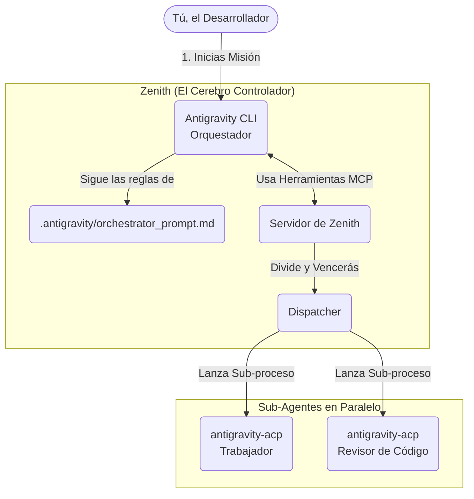

# 🚀 Guía de Uso: Antigravity CLI + Zenith

¡Bienvenidos! En esta guía explicaremos de forma sencilla qué es lo que acabamos de construir y cómo puedes utilizar **Antigravity CLI** orquestado por **Zenith** para resolver tareas de programación de largo alcance.

> [!NOTE]
> **Contexto Rápido**
> Zenith es un "Orquestador" que obliga a los agentes de IA a ser más disciplinados. En lugar de intentar resolver un problema enorme de una sola vez, Zenith divide el problema, manda a "sub-agentes" a trabajar en paralelo y revisa el código rigurosamente.

---

## 🧠 1. ¿Qué construimos?

Anteriormente, Zenith solo sabía comunicarse con herramientas como Claude Code o Codex. Nosotros hemos construido un puente (llamado **Adaptador ACP**) para que Zenith pueda comunicarse nativamente con **Antigravity CLI** (que por debajo utiliza los poderosos modelos **Gemini 3.1 Pro** y **3.5 Flash**).

### Así funciona la arquitectura ahora



---

## 🛠️ 2. Guía Paso a Paso para Juniors

Usar esta nueva súper-herramienta es muy fácil. Sigue estos pasos para tu próximo gran proyecto:

### Paso A: Inicializar tu proyecto

Primero, dile a Zenith que vas a trabajar en tu repositorio y que quieres usar Antigravity como tu agente.

> [!IMPORTANT]
> Debes ejecutar este comando **desde el directorio donde tienes instalado Zenith**, pero apuntando al directorio de **tu proyecto**.

```bash
# Ubícate en el directorio de zenith
cd /ruta/a/tu/zenith/zenith

# Inicializa tu proyecto (reemplaza /ruta/a/mi-proyecto por el tuyo)
uv run zenith init --workspace-dir /ruta/a/mi-proyecto --agent antigravity
```

**¿Qué hace esto?**
Zenith irá a tu proyecto e instalará carpetas invisibles (como `.antigravity/` y `.agents/`) que contienen las reglas estrictas y las herramientas que el agente necesita.

### Paso B: Despertar al Orquestador

Ahora, ve a la carpeta de tu proyecto e inicia el CLI de Antigravity normalmente.

```bash
cd /ruta/a/mi-proyecto
agy
```

### Paso C: Dar la Misión

Una vez dentro del chat de Antigravity, no le pidas que programe directamente. En su lugar, dale **el Prompt de Orquestador** para que asuma su rol de Manager:

> **Copia y pega esto en el chat de Antigravity:**
> "First Read the `.antigravity/orchestrator_prompt.md` and treat it as your primary role, then use Zenith to run this mission.
>
> *[Aquí escribes la tarea gigante que quieres que haga, por ejemplo: Necesito que migres toda esta base de datos a PostgreSQL y escribas los tests unitarios]*"
>
> [!TIP]
> **Magia en acción:** A partir de ese momento, verás que Antigravity dejará de actuar como un simple asistente y empezará a invocar herramientas de Zenith, lanzar trabajadores fantasmas en paralelo y verificar su propio trabajo. ¡Déjalo pensar!

---

## 🔍 3. Resumen Técnico (¿Qué archivos modificamos?)

Si sientes curiosidad sobre el código fuente que hizo esto posible, aquí están los cambios:

1. **El Adaptador ACP (`agy-acp/agy_acp_server.py`)**:
   Es un pequeño servidor en Python que se comunica mediante el protocolo JSON-RPC sobre la entrada y salida estándar (`stdio`). Su trabajo es traducir las órdenes de Zenith a comandos que Antigravity entienda.

2. **Registro en Zenith (`zenith/src/zenith_harness/providers.py`)**:
   Inyectamos la configuración de `antigravity` en los diccionarios internos de Zenith. Zenith es tan modular que al hacer esto, todos los comandos de la consola (`cli.py`) lo adoptaron automáticamente.

¡Y eso es todo! Ahora tienes el entorno de programación multi-agente más avanzado a tu disposición.
