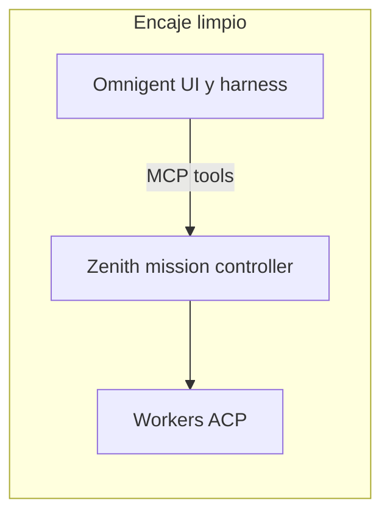

# Consejo: integrar Zenith con Omnigent

## Veredicto

**Omnigent.** Es la única de las tres que aporta lo que Zenith no tiene (superficie conversacional, UI, sesión, YAML de agente) sin disputarle el rol de controlador de misión.

Ya hay camino marcado: provider `omnigent` en Zenith, guía en [`zenith/omnigent/README.md`](zenith/omnigent/README.md) y plan MVP en [`.cursor/plans/zenith_en_omnigent_dce0d41b.plan.md`](.cursor/plans/zenith_en_omnigent_dce0d41b.plan.md).



## Por qué Zenith necesita un “host”, no otro orquestador

Zenith **no es un agente LLM**. Es un harness/runtime determinista (contrato, task list, gates, atención, terminal review) que habla MCP hacia arriba y ACP hacia abajo. Su valor es la especificidad de misiones largas y *premature completion*.

Para brillar necesita:
- un **cerebro conversacional** que lea el prompt de orquestador y llame tools MCP;
- **workers** ACP que implementen;
- una **UI/sesión** opcional pero útil.

No necesita un segundo scheduler de misiones encima.

## Comparación por encaje

| Criterio | Omnigent | Bernstein | OpenHands |
| --- | --- | --- | --- |
| Rol natural vs Zenith | Host conversacional + UI | Orquestador paralelo | Agente autónomo / worker |
| Solapamiento con Zenith | Bajo (Polly sí; Omnigent-host no) | Alto (ambos controlan misión) | Medio (loop + planning propios) |
| Preserva especificidad de Zenith | Sí | Se diluye o se pelea | Se diluye si Zenith queda “dentro” del loop |
| Esfuerzo / precedente | Ya documentado y parcialmente modelado | Integración nueva y conflictiva | Mejor como worker que como host |
| Multiplicador práctico | UI multi-dispositivo, policies, YAML portable | Audit/worktrees/gates (redundantes con Zenith) | Sandboxes e integraciones Git (útiles, pero como capa de ejecución) |

### 1. Omnigent — recomiendo

- **Complemento real:** Omnigent = cara y runtime del YAML; Zenith = estado de misión + dispatch ACP.
- **Sin pelear el DAG:** el agente Omnigent no implementa; usa `start_project` / `submit_plan` / `advance_project`.
- **Encaje de producto:** meta-harness multi-vendor (Claude, Codex, OpenCode, …) + sesión portable; Zenith aporta la disciplina que Polly no tiene (contrato, gates, atención, terminal review).
- **Cuidado único:** no mezclar **Polly** y Zenith sobre la misma misión (son orquestadores alternativos). Omnigent-host + Zenith-MCP sí.

### 2. Bernstein — no como pareja principal

Bernstein y Zenith son **hermanos conceptuales**: ambos orquestan coding agents con verificación, paralelismo y estado durable.

- Bernstein: orquestación 0-LLM en el tick, audit criptográfico, worktrees, 46 adapters CLI.
- Zenith: orquestación vía coding agent + MCP, contrato falsificable, workers ACP, atención explícita.

Integrarlos como “Zenith dentro de Bernstein” o al revés fuerza **dos control planes** (quién es dueño del plan, retries, merge, “done”). Pierdes la especificidad de Zenith o la de Bernstein. Bernstein ya puede usar agentes CLI solos; no necesita el runtime MCP de Zenith para funcionar.

Útil más adelante solo como **idea de features a robar** (audit chain, worktrees, evidence) o, en el límite, Bernstein como *worker* — no como host.

### 3. OpenHands — mejor como worker, no como host

OpenHands es un **agente de coding self-hosted** (Agent Canvas + sandbox + loop observe-think-act), con planning interno (`PLAN.md`), no un controlador de misión multi-nodo externo.

- Montar Zenith “dentro” de OpenHands choca con su propio agente/planning.
- Usar OpenHands **debajo** de Zenith (CLI/ACP worker) sí tiene sentido — Bernstein ya lo trata así vía adapter.
- No multiplica la especificidad de Zenith; solo añade otra superficie de ejecución.

## Arquitectura objetivo (Omnigent)

```text
Desarrollador
  → omnigent run .omnigent/zenith-orchestrator
    → MCP Zenith (misión, plan, advance)
      → Workers ACP (claude / codex / opencode / …)
```

Roles:
- **Omnigent:** harness + UI + sesión.
- **Zenith:** controlador de misión.
- **ACP:** implementación; Omnigent no es worker.

## Qué haría después (si confirmas Omnigent)

Seguir el plan existente [`zenith_en_omnigent_dce0d41b.plan.md`](.cursor/plans/zenith_en_omnigent_dce0d41b.plan.md): provider `omnigent_yaml`, bundle `.omnigent/zenith-orchestrator/`, CLI `zenith init --agent omnigent`, docs y tests — sin modificar el repo Omnigent ni tratar Omnigent como worker ACP.
