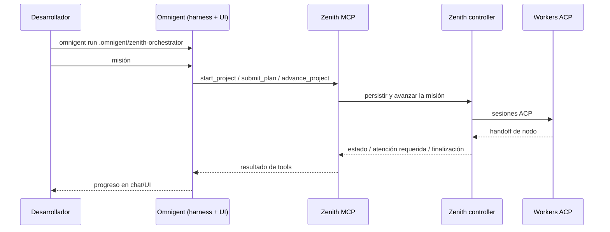

# Guía de Uso: Omnigent + Zenith

En esta guía se explica cómo usar **Omnigent** como harness conversacional y **Zenith** como controlador de misión (MCP), con workers ACP por debajo.

> [!NOTE]
> **Contexto rápido**
> Omnigent aporta la UI/sesión y el agente YAML. Zenith persiste la misión, expone tools MCP (`start_project`, `submit_plan`, `advance_project`, …) y lanza workers ACP. Polly y Zenith son orquestadores **alternativos** para la misma misión: no mezcles ambos sobre un mismo plan.

---

## 1. Arquitectura y responsabilidades



Roles:

| Pieza | Rol |
| --- | --- |
| **Omnigent** | Cerebro conversacional y superficie de ejecución del YAML (`executor.type: omnigent`). Harness por defecto: `claude-sdk` (o `opencode` si lo pides). |
| **Zenith** | Controlador de misión y superficie MCP stdio. |
| **Workers / validator / reviewer** | Procesos ACP configurados con `ZENITH_*`. Omnigent **no** es un worker ACP. |

`zenith init --agent omnigent` genera este bundle en el proyecto destino:

```text
.omnigent/zenith-orchestrator/
├── config.yaml    # gestionado por init (se sobrescribe)
└── AGENTS.md      # prompt de orquestador (solo se crea si no existe)
```

Omnigent acepta el directorio directamente (`omnigent run .omnigent/zenith-orchestrator`) y resuelve su `config.yaml`. No se crea ni modifica `.mcp.json` en esta integración: el MCP va declarado en el YAML.

---

## 2. Requisitos

1. **Checkout de Zenith** ejecutable con `uv` (el `init` descubre la raíz del proyecto `zenith-harness` y la fija en `tools.zenith.args`). No muevas ni elimines ese checkout mientras uses el bundle.
2. **Omnigent** instalado y configurado (`omnigent setup` o credenciales del harness elegido).
3. Binarios y autenticación del **worker ACP** elegido, por ejemplo:
   - `claude-agent-acp` (default con worker `claude`)
   - `codex-acp`
   - `opencode acp`

### Trust / sandbox

El MCP de Zenith se lanza como subprocess stdio **sin sandbox propio** de Omnigent (`os_env.sandbox.type: none` en el bundle). El bundle **no** incrusta secretos: solo reenvía variables de un allowlist (p. ej. `ANTHROPIC_*`, `ZAI_*`) y la configuración `ZENITH_*` de providers/ACP. Revisa el entorno del proceso padre antes de confiar en el run.

---

## 3. Comandos canónicos

Ejecuta `init` **desde el checkout de Zenith**, apuntando al proyecto destino:

```bash
# Default: harness Omnigent claude-sdk + worker ACP claude
uv run zenith init --workspace-dir /ruta/proyecto --agent omnigent

# Worker ACP OpenCode (Omnigent sigue siendo el host conversacional)
uv run zenith init --workspace-dir /ruta/proyecto --agent omnigent \
  --worker-provider opencode

# Harness Omnigent opencode + worker ACP opencode
uv run zenith init --workspace-dir /ruta/proyecto --agent omnigent \
  --omnigent-harness opencode --worker-provider opencode

cd /ruta/proyecto
omnigent run .omnigent/zenith-orchestrator
```

En el chat de Omnigent, da la misión. El agente debe usar las tools MCP de Zenith para planificar y avanzar; **no** implementar el trabajo directamente en la sesión de Omnigent.

`--omnigent-harness` solo es válido con orquestador `omnigent`. Con otros agentes (`claude`, `codex`, …) el flag produce error de uso.

### Idempotencia

- Re-ejecutar `init` **sobrescribe** `.omnigent/zenith-orchestrator/config.yaml`.
- **Preserva** un `AGENTS.md` ya editado.
- No borra otros archivos bajo `.omnigent/`.

---

## 4. Qué no cubre esta integración

- No hay adaptador `omnigent acp` ni Omnigent como worker ACP.
- No se modifica el repositorio de Omnigent.
- Omnigent no consume la `.mcp.json` de otros agentes para este flujo: usa el MCP declarado en `config.yaml`.
- No mezclar Polly y Zenith sobre la misma misión.
