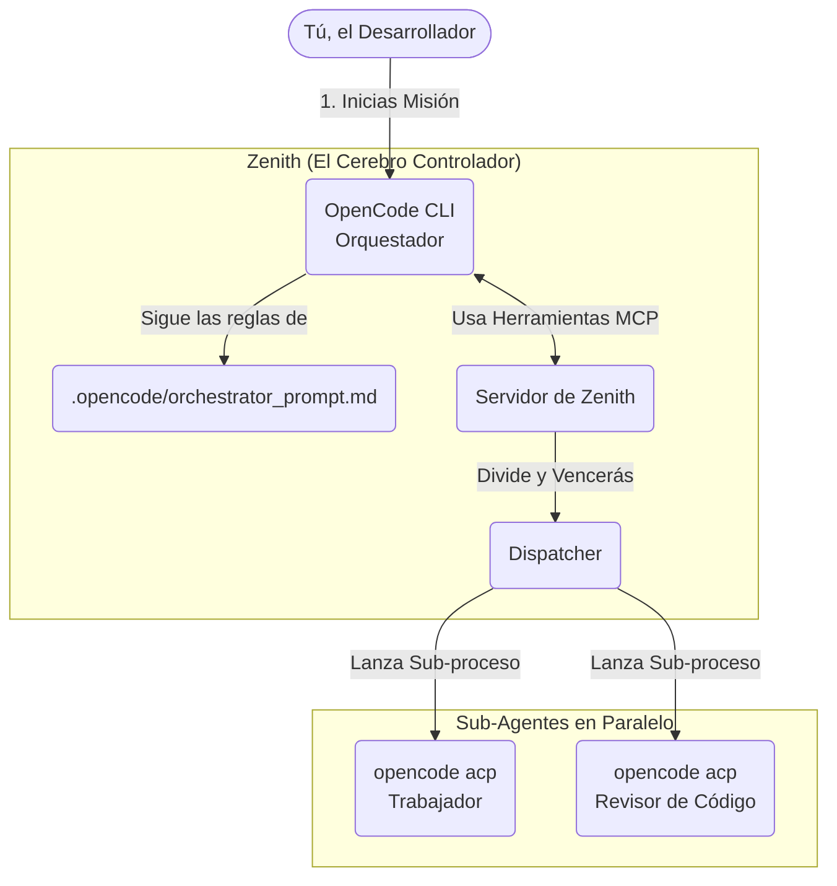

# 🚀 Guía de Uso: OpenCode + Zenith

¡Bienvenidos! En esta guía explicaremos cómo utilizar **OpenCode** orquestado por **Zenith** para resolver tareas de programación complejas.

> [!NOTE]
> **Contexto Rápido**
> Zenith es un "Orquestador" que obliga a los agentes de IA a ser más disciplinados. En lugar de intentar resolver un problema enorme de una sola vez, Zenith divide el problema, manda a "sub-agentes" a trabajar en paralelo y revisa el código rigurosamente.

---

## 🧠 1. ¿Cómo funciona la arquitectura?

A diferencia de otras integraciones, **OpenCode** ya soporta nativamente el estándar **Agent Client Protocol (ACP)** mediante el comando `opencode acp`. Esto significa que Zenith se puede conectar directamente sin necesidad de construir adaptadores adicionales.

### Diagrama de la integración



---

## 🛠️ 2. Guía Paso a Paso para Juniors

Usar Zenith junto con OpenCode requiere dos sencillos pasos:

### Paso A: Inicializar tu proyecto

Primero, indícale a Zenith que vas a trabajar en tu repositorio y que quieres usar OpenCode como tu agente.

> [!IMPORTANT]
> Debes ejecutar este comando **desde el directorio donde tienes instalado Zenith**, pero apuntando al directorio de **tu proyecto**.

```bash
# Ubícate en el directorio de zenith
cd /ruta/a/tu/zenith/zenith

# Inicializa tu proyecto (reemplaza /ruta/a/mi-proyecto por el tuyo)
uv run zenith init --workspace-dir /ruta/a/mi-proyecto --agent opencode
```

**¿Qué hace esto?**
Zenith irá a tu proyecto e instalará carpetas invisibles (como `.opencode/` y `.agents/`) que contienen las reglas estrictas y las herramientas que el agente necesita.

### Paso B: Despertar al Orquestador

Ahora, ve a la carpeta de tu proyecto e inicia el CLI de OpenCode normalmente.

```bash
cd /ruta/a/mi-proyecto
opencode
```

### Paso C: Dar la Misión

Una vez dentro del chat de OpenCode, pégale **el Prompt de Orquestador** para que asuma su rol de Manager:

> **Copia y pega esto en el chat de OpenCode:**
> "First Read the `.opencode/orchestrator_prompt.md` and treat it as your primary role, then use Zenith to run this mission.
>
> *[Aquí escribes la tarea gigante que quieres que haga, por ejemplo: Necesito que migres toda esta base de datos a PostgreSQL y escribas los tests unitarios]*"
>
> [!TIP]
> **Magia en acción:** Verás que OpenCode usará automáticamente las herramientas de Zenith, lanzando procesos `opencode acp` invisibles en el fondo para probar y revisar el código antes de dártelo por terminado.

---

## 💡 3. Sobre las Suscripciones de OpenCode

Recuerda que para correr OpenCode puedes optar por:

1. **OpenCode Go**: Ideal si prefieres una tarifa mensual predecible ($10/mes) para acceso ilimitado a modelos Open-Source validados.
2. **OpenCode Zen**: Ideal si quieres pagar por demanda (pay-as-you-go) utilizando los modelos Premium más potentes al precio de costo de la API.
3. **Gratuito**: Puedes seguir usando tus propias *API Keys* si así lo prefieres.
