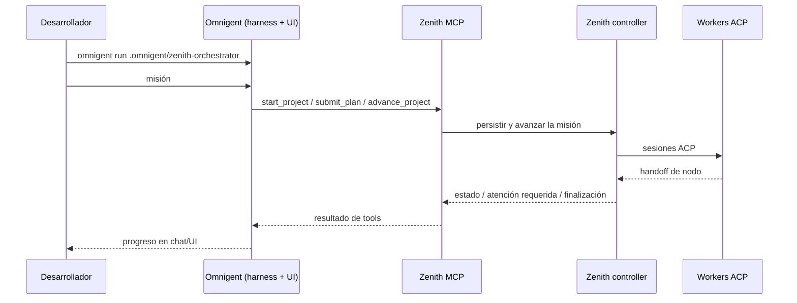

# Zenith dentro de Omnigent (MVP)

## Resultado y límites

El resultado será un **agent bundle de Omnigent** creado en el proyecto destino:

```text
.omnigent/zenith-orchestrator/
├── config.yaml
└── AGENTS.md
```

`omnigent run .omnigent/zenith-orchestrator` acepta directamente ese directorio (Omnigent resuelve su `config.yaml`). El agente usa el MCP stdio de Zenith y, a su vez, Zenith abre los workers con ACP. No se implementará un adaptador `omnigent acp`, ni se modificará el repositorio Omnigent, ni se mezclará Polly con Zenith sobre una misma misión.



Roles explícitos:

- **Omnigent** es el cerebro conversacional y la superficie de ejecución del YAML. El harness es `claude-sdk` por defecto u `opencode` cuando se solicite.
- **Zenith** es el controlador de misión y la superficie MCP.
- **Workers/validator/reviewer de Zenith** siguen siendo procesos ACP configurados con `ZENITH_*`; Omnigent no pasa a ser un worker.

## Decisiones verificadas contra el código actual

| Tema | Decisión |
| --- | --- |
| Formato | Nuevo `config_format: "omnigent_yaml"`; no se crea ni modifica `.mcp.json`. |
| Bundle | `.omnigent/zenith-orchestrator/config.yaml`; Omnigent admite un directorio que contenga `config.yaml`. |
| Prompt | `instructions: AGENTS.md`, con el prompt bundled de Zenith en ese archivo. Omnigent resuelve rutas relativas al YAML. |
| Executor | Usar el formato de bundles de Omnigent: `executor.type: omnigent` y `executor.config.harness`. |
| MCP | `tools.zenith` stdio con `uv run --project <zenith-root> zenith-server --mode orchestrator`. |
| Env | `selection.env()` + `_storage_env()` + `_forwarded_mcp_env()`. El parser de Omnigent superpone `tools.*.env` al entorno padre del subprocess; conservar el allowlist evita introducir secretos ajenos. |
| Provider | `omnigent` sólo pertenece a `ORCHESTRATOR_PROVIDER_NAMES`; el worker predeterminado es `claude`. |
| Assets | Instalar skills en `.omnigent/skills` y `.agents/skills`; crear `AGENTS.md` únicamente si no existe, como los prompts actuales, para no pisar edición local. |
| Idempotencia | Sobrescribir sólo el `config.yaml` generado; preservar `AGENTS.md` existente y no afectar otros archivos bajo `.omnigent/`. |
| Seguridad | El MCP stdio de Omnigent se ejecuta sin sandbox propio. El bundle no añade secretos; el requisito de trust queda documentado y el allowlist se mantiene. |

## Cambios de implementación

### 1. Provider y resolución de selección

Archivo: [`providers.py`](zenith/zenith/src/zenith_harness/providers.py)

- Extender `ProviderName` con `"omnigent"` y `ConfigFormat` con `"omnigent_yaml"`.
- Añadir `omnigent` solamente a `ORCHESTRATOR_PROVIDER_NAMES`; no añadirlo a `WORKER_PROVIDER_NAMES`.
- Registrar:

  ```python
  "omnigent": ProviderDefinition(
      name="omnigent",
      skill_dirs=(".omnigent/skills", ".agents/skills"),
      skill_alias_dirs=(".omnigent/skills", ".agents/skills"),
      config_format="omnigent_yaml",
      default_worker_acp_command=None,
      agent_output_dir=None,
      orchestrator_prompt_output_path=".omnigent/zenith-orchestrator/AGENTS.md",
  )
  ```

- Hacer que `default_worker_provider_name("omnigent")` devuelva `"claude"`. Mantener el fallback existente para nombres no registrados.
- Verificar que `--agent omnigent --worker-provider <worker válido>` funciona: como Omnigent no es un worker, `_resolve_selection` ya debe escoger el default o el worker explícito, nunca intentar `get_provider("omnigent")` para ese rol.

### 2. CLI y emisión del bundle

Archivo: [`cli.py`](zenith/zenith/src/zenith_harness/cli.py)

- Añadir `--omnigent-harness`, con `click.Choice(["claude-sdk", "opencode"])` y default `None`, a `init` y a su firma; el default efectivo será `"claude-sdk"` sólo para el provider `omnigent`.
- Validar antes de escribir archivos: si se pasa `--omnigent-harness` y el orquestador resuelto no es `omnigent`, devolver `click.UsageError`. Para distinguir default de uso explícito, el valor del option debe ser `None` inicialmente y el default efectivo (`claude-sdk`) debe resolverse sólo en la rama Omnigent.
- Pasar el harness efectivo a `_write_bootstrap_config` (o encapsularlo en una pequeña estructura de opciones de bootstrap), sin acoplarlo a `ProviderSelection`, que representa providers Zenith y no harnesses Omnigent.
- Añadir rama `omnigent_yaml` que cree el directorio y serialice con `yaml.safe_dump(..., sort_keys=False, allow_unicode=True)` —PyYAML ya es dependencia directa de Zenith— el siguiente mapping, usando `server_args = _mcp_server_args()` y el env ya resuelto:

  ```yaml
  spec_version: 1
  name: zenith-orchestrator
  description: Zenith mission orchestrator hosted by Omnigent
  executor:
    type: omnigent
    config:
      harness: claude-sdk       # o opencode
  instructions: AGENTS.md
  tools:
    zenith:
      type: mcp
      command: uv
      args: [run, --project, <zenith-root>, zenith-server, --mode, orchestrator]
      env:
        ZENITH_ORCHESTRATOR_PROVIDER: omnigent
        ZENITH_WORKER_PROVIDER: claude
        # ZENITH_WORKER_ACP_COMMAND, ZENITH_VALIDATOR_*,
        # ZENITH_HOME y sólo las variables permitidas que apliquen
  os_env:
    type: caller_process
    cwd: .
    sandbox:
      type: none
  ```

- Para esta rama, formar el env como `{**selection.env(), **storage_env, **_forwarded_mcp_env()}`. Así se conserva la semántica de `.mcp.json`, incluyendo comando ACP custom, validator y credenciales/model endpoints incluidos expresamente en el allowlist.
- No añadir `tools:` allowlist: Zenith debe exponer toda su superficie MCP. No añadir `executor.model`/`auth`: Omnigent resuelve su harness configurado (`omnigent setup`) o sus credenciales normales.
- Usar la política actual de `_setup_provider_assets`: el primer `init` escribe el prompt bundled; reinicializaciones preservan el archivo. Aclarar en un comentario o en el test que sólo `config.yaml` es gestionado por el generador.
- Ajustar `_echo_next_steps`: para Omnigent mostrar exactamente `omnigent run .omnigent/zenith-orchestrator` y una instrucción de misión que recuerde usar las tools Zenith y no implementar directamente. Los demás providers conservan su salida actual.

### 3. Documentación

Nuevo archivo: [`zenith/omnigent/README.md`](zenith/omnigent/README.md)

- Seguir el enfoque didáctico de `zenith/opencode/README.md`, sin afirmar soporte no existente.
- Explicar arquitectura y separación Omnigent/Zenith/ACP, y que Polly y Zenith son orquestadores alternativos para la misma misión.
- Requisitos: checkout de Zenith ejecutable con `uv`, `omnigent` instalado/configurado, y los binarios/autenticación del worker ACP elegido (`claude-agent-acp`, `codex-acp` u `opencode acp`). Incluir que el MCP se lanza desde el checkout de Zenith descubierto por `init`; no mover ni eliminar ese checkout mientras se use el bundle.
- Documentar los comandos canónicos:

  ```bash
  uv run zenith init --workspace-dir /ruta/proyecto --agent omnigent
  uv run zenith init --workspace-dir /ruta/proyecto --agent omnigent \
    --worker-provider opencode
  uv run zenith init --workspace-dir /ruta/proyecto --agent omnigent \
    --omnigent-harness opencode --worker-provider opencode
  cd /ruta/proyecto
  omnigent run .omnigent/zenith-orchestrator
  ```

- Indicar el alcance de `sandbox.type: none` y que Omnigent no consume la `.mcp.json` de otros agentes para esta integración; usa el MCP declarado en `config.yaml`.

### 4. Tests y verificación

Archivo: [`test_cli.py`](zenith/zenith/tests/test_cli.py)

- Importar `yaml` y añadir un test de caso feliz que ejecute `init --agent omnigent`, cargue `config.yaml` y verifique:
  - directorio, YAML y `AGENTS.md` existen; `.mcp.json` no se crea;
  - `spec_version`, `name`, `instructions`, `executor.type`, harness default, `os_env` y `tools.zenith` son correctos;
  - `args` coincide con `_expected_mcp_server_args()`;
  - env contiene `ZENITH_ORCHESTRATOR_PROVIDER=omnigent`, worker `claude`, `ZENITH_WORKER_ACP_COMMAND=claude-agent-acp` y `ZENITH_HOME` cuando se proporciona;
  - la salida incluye el comando de `omnigent run`.
- Añadir variante `--omnigent-harness opencode --worker-provider opencode --worker-acp-command ... --validator-provider codex --validator-acp-command ...` y comprobar harness + todos los `ZENITH_*` esperados. Esto evita que una nueva ruta YAML pierda configuración que el camino `.mcp.json` ya transporta.
- Añadir prueba de `--omnigent-harness opencode` con `--agent claude` (o `--orchestrator-provider claude`) que falle con `UsageError` y no cree bootstrap.
- Añadir prueba de idempotencia: editar `AGENTS.md` entre dos `init`, comprobar que se preserva; modificar/sembrar `config.yaml`, reinicializar y comprobar que vuelve al mapping generado. También comprobar que un archivo vecino bajo `.omnigent/zenith-orchestrator/` no se elimina.
- Añadir prueba de allowlist equivalente a la de Claude: las variables admitidas aparecen en `tools.zenith.env` y `DATABASE_URL` no.
- Ejecutar desde `zenith/`: `uv run pytest tests/test_cli.py`, `uv run ruff check src tests` y `uv run mypy src`. Como validación de contrato cruzado, ejecutar el loader local de Omnigent contra un bundle temporal generado (o un test unitario de Omnigent sólo si se trabaja también allí) para confirmar que su parser acepta el directorio/YAML; no hacer smoke ACP con credenciales reales.

## Criterios de aceptación

1. `zenith init --agent omnigent` genera un bundle que Omnigent puede cargar y cuyo MCP recibe exactamente los argumentos y variables que necesita Zenith.
2. Omnigent nunca aparece como worker seleccionable ni como comando ACP de worker.
3. Las variantes de harness y workers personalizados se reflejan correctamente en YAML.
4. Re-ejecutar `init` es seguro: actualiza la configuración gestionada y respeta la edición local del prompt.
5. La guía permite reproducir el flujo completo y deja claros requisitos, trust boundary y la relación con Polly.
